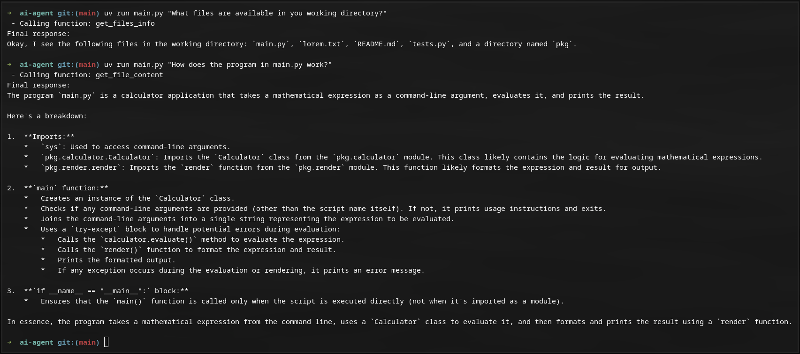

# AI Code Assistant

The **AI Code Assistant** is a Python-based project designed to assist developers by automating tasks such as listing files, reading file contents, writing to files, and executing Python scripts. It leverages the power of AI to interpret user prompts and execute corresponding actions.

## Security !!!

It's important to note that the program **can run code** in the working directory (including the code that it wrote itself), that possibly makes it a security concern. Use at your own risk.

## Features

- **File Operations**: 
  - List files and directories.
  - Read the content of files.
  - Write content to files.
- **Code Execution**:
  - Run Python scripts dynamically.
- **AI-Powered Assistance**:
  - Uses the Gemini API to interpret user prompts.

## Screenshot



## Usage

1. **Clone the repo:** 
    ```bash
    git clone https://github.com/krz-sta/ai-agent
    ```
2. **Change working directory:**
    ```bash
    cd ai-agent
    ```

3. **Initialize uv:**
    ```bash
    uv init
    ```

4. **Create a new virtual environment**:
    ```bash
    uv venv
    ```

5. **Initialize the virtual environment:**
    ```bash
    source .venv/bin/activate
    ```

6. **Add dependencies:**
    ```bash
    uv add -r requirements.txt
    ```

7. **Create a ```.env``` file with you Gemini API key:** (format below)
    ```bash
    GEMINI_API_KEY="your_api_key"
    ```

8. **Paste the directory of a project you with to edit into the ai-agent directory:**

9. **Change this value to the name of the directory that contains you project:** (example below)
    ```bash
    WORKING_DIR = "./calculator"
    ```

10. **Run the app:**
    ```bash
    uv run main.py "Your Prompt"
    ```

## Requirements

- Python 3.8 or higher
- Gemini AI API key
- UV